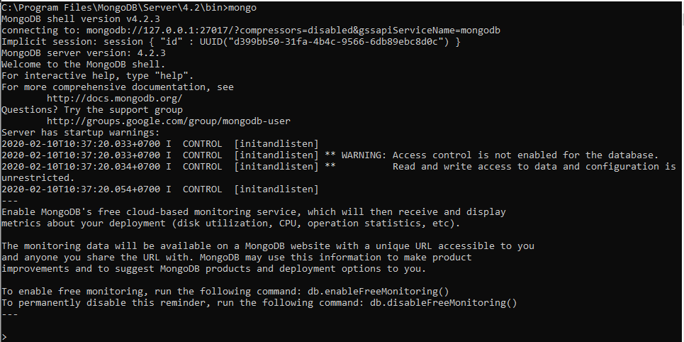
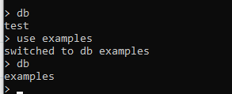
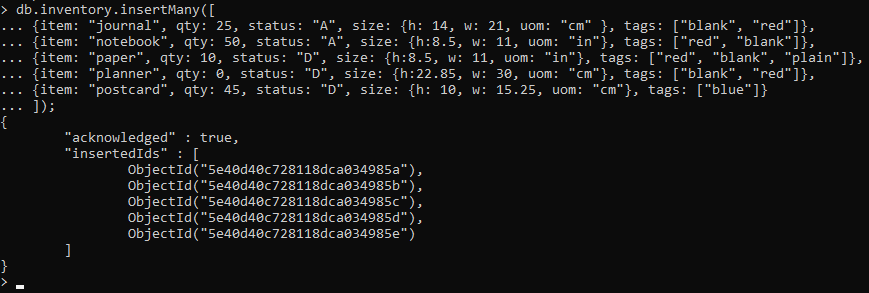
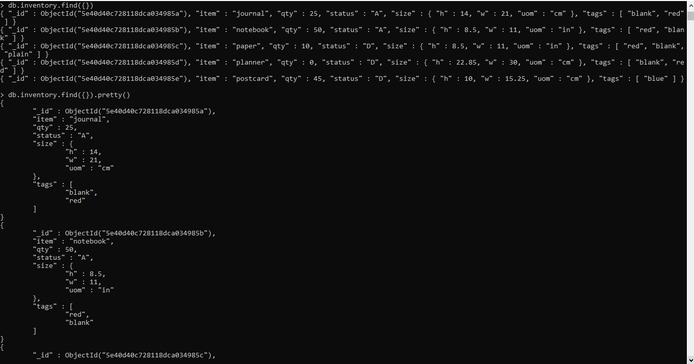
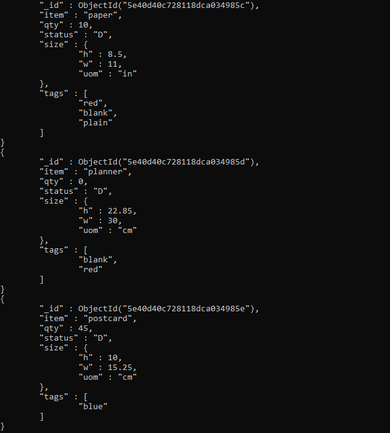
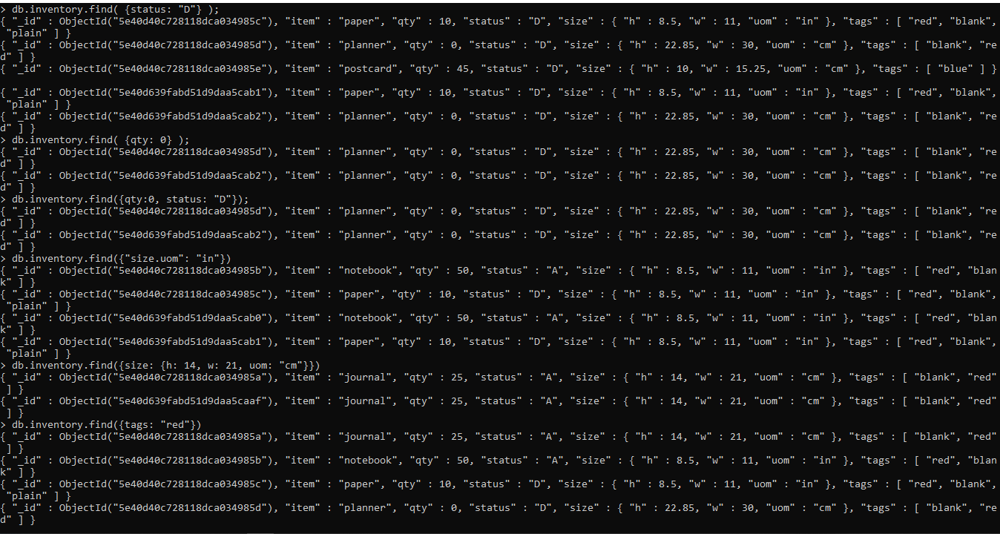
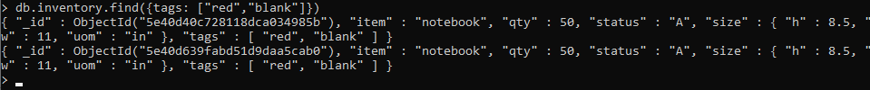
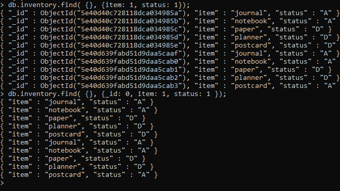

# LAPORAN MINGGU 2
LATIHAN
pada praktikum kali ini kita akan menggunakan mongoDb. yang pertama kita akan mencoba
menginstallnya dan kita akan mencoba menggunkannya. maka pada gambar pertama ini kita akan
menjalankan, dan akan terlihat hasil seperti gambar berikut ini :

TUGAS