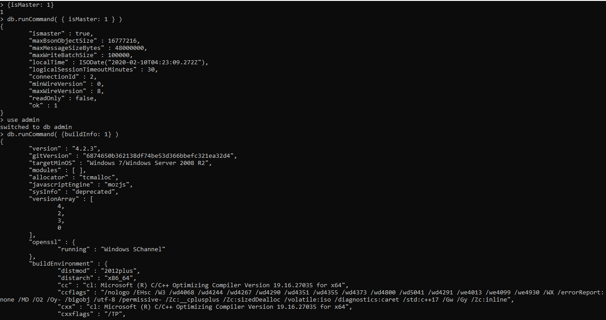
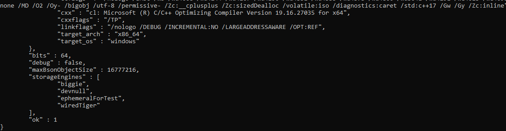
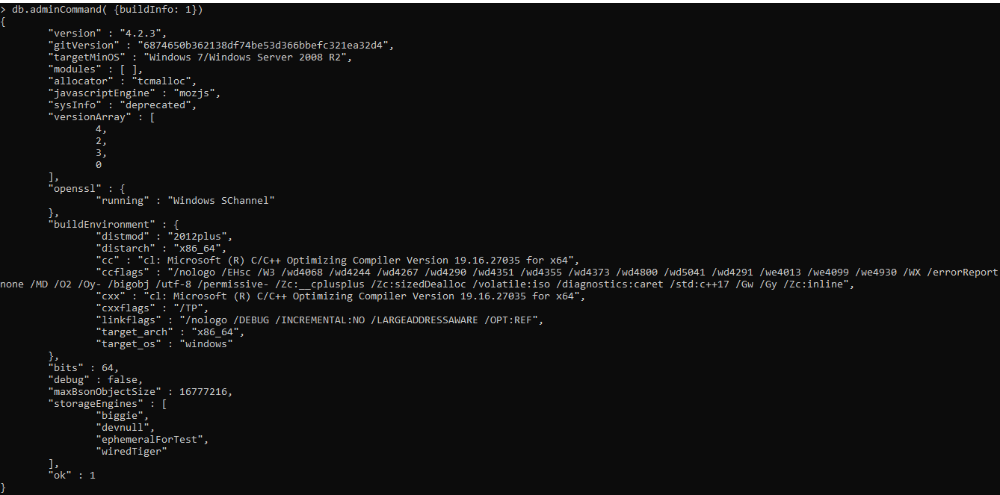
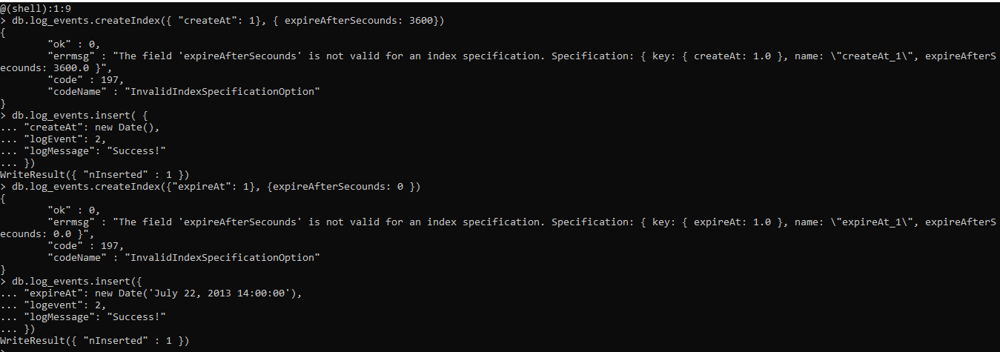
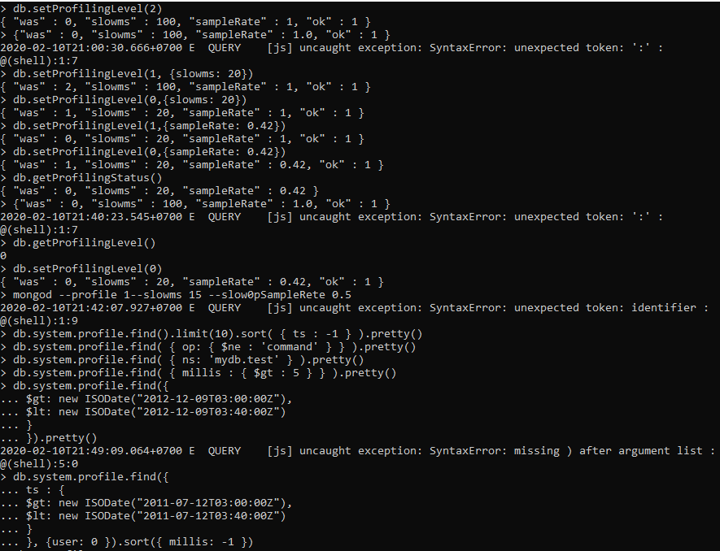
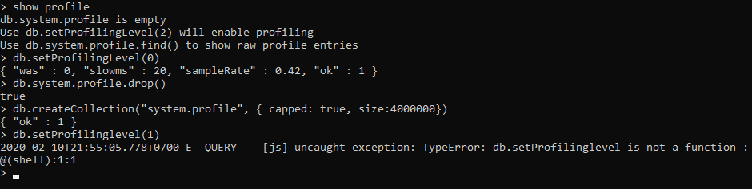
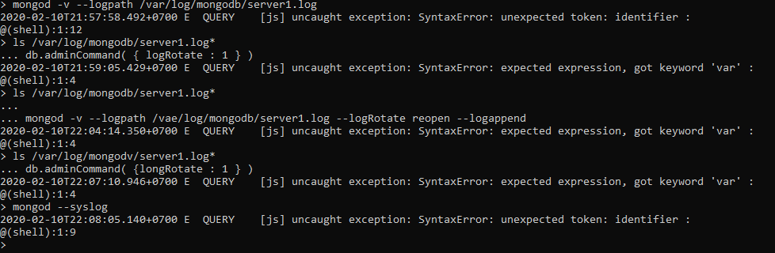
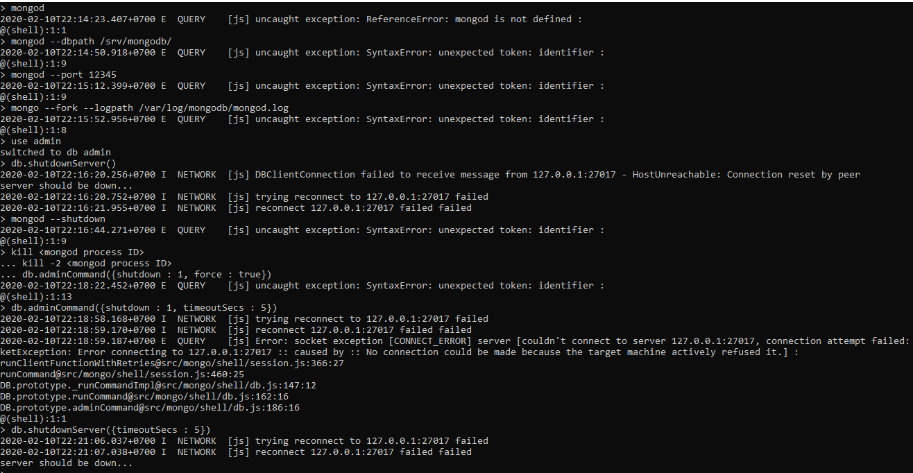
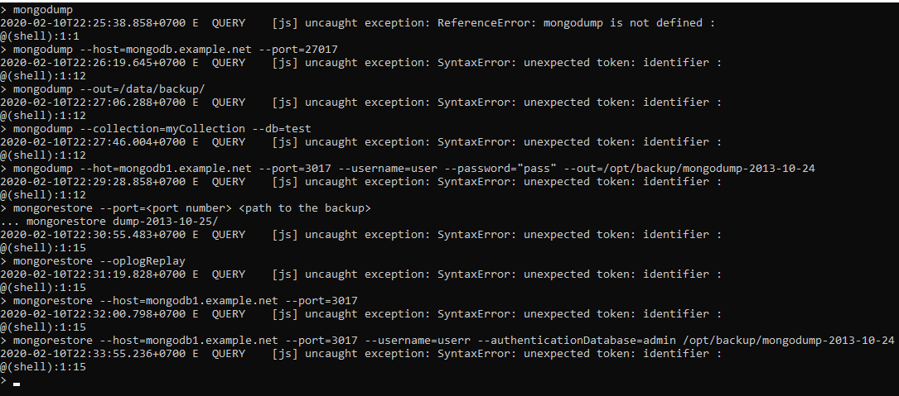
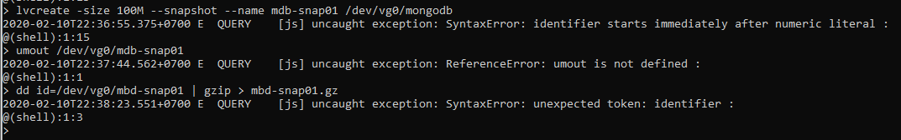

# LAPORAN MINGGU 2
LATIHAN

pada praktikum kali ini kita akan menggunakan mongoDb. yang pertama kita akan mencoba
menginstallnya dan kita akan mencoba menggunkannya. maka pada gambar pertama ini kita akan
menjalankan, dan akan terlihat hasil seperti gambar berikut ini :

selanjutnya kita akan melihat penggunaan NoSQL maka dimulai dengan gambar berikut ini :

pada praktik ini semua data menjadi 2, karena saya memasukkan datanya dua kali, sehingga 
mengakibatkan semua data yang ingin kita tampilkan menjadi duoble. maka akan terlihat 
seperti gambar berikut ini :

TUGAS

