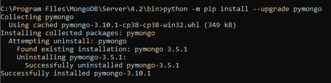
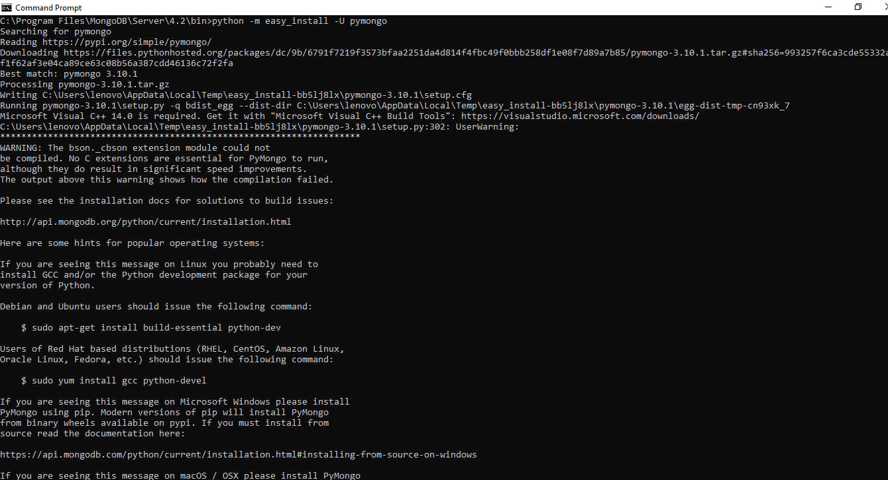
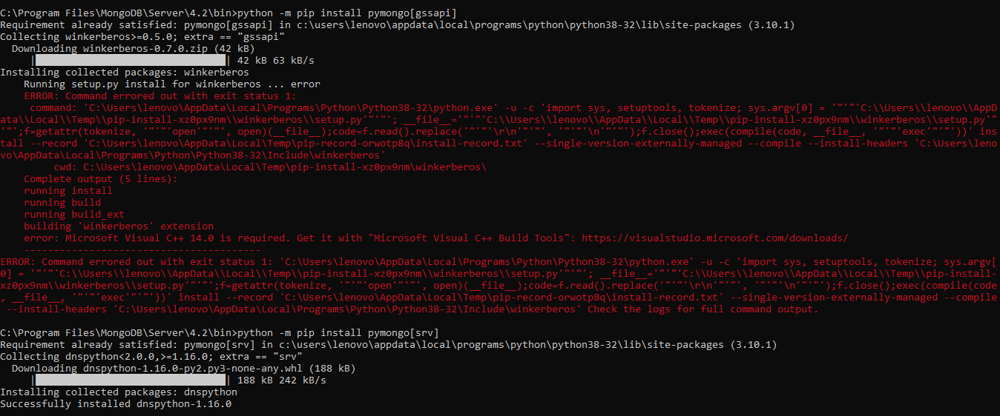
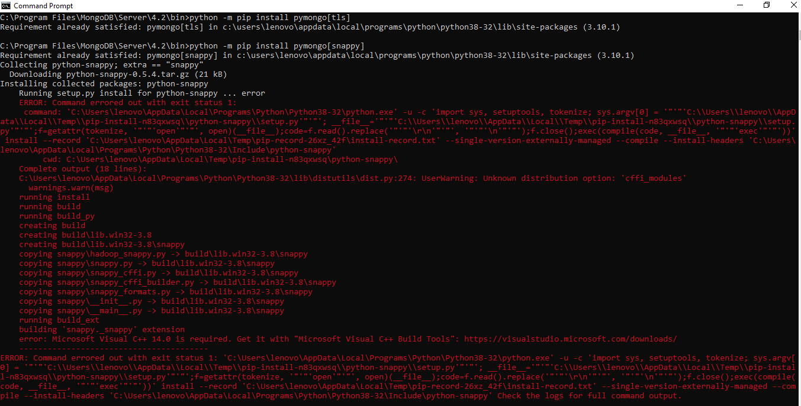
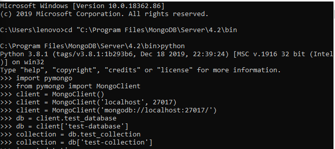
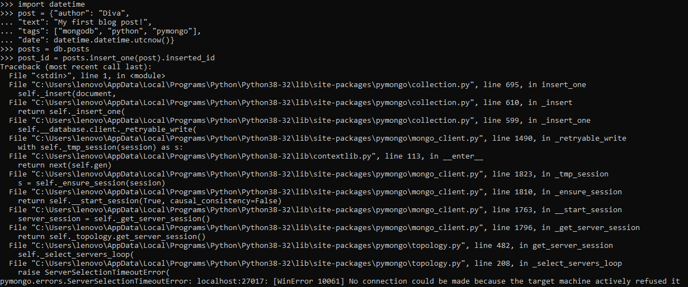
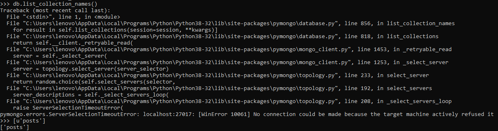
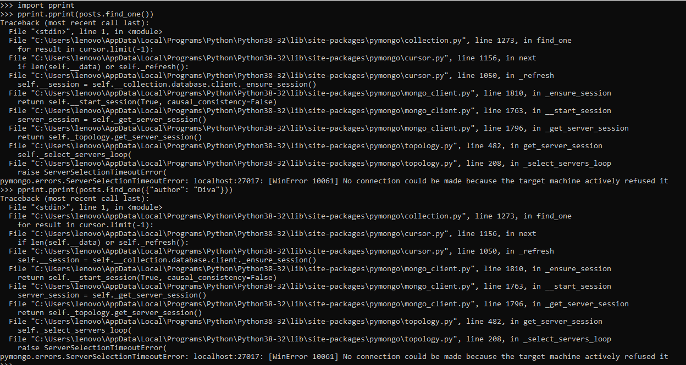
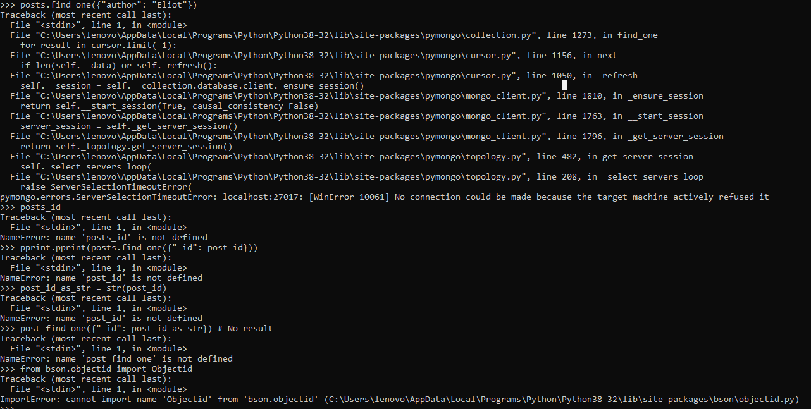
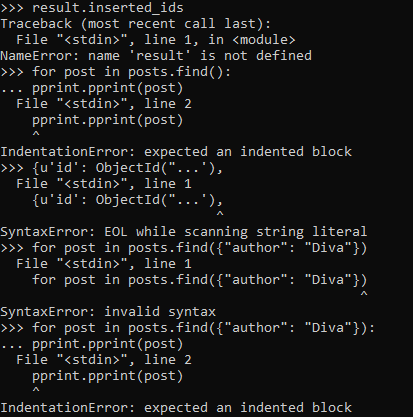

# LAPORAN MINGGU 3
pada gambar dibawah ini adalah sebuah cara instalisasi dari pymongo. 
terlihat ada bebrapa yang merah-merah eror adalah sebuah tanda bahwa tidak bisa dinstal
dengan sever tersebut.

pada gambar berikut adalah contoh dari intsallisasi pymongo.

terlihat banyak yang eror karena ada bebrapa yang tidak ada diserver.

selanjutnya kita akan melanjutkan mengerjakan pymongo maka akan 
terlihat hasil seperti gambar berikut ini :

