# LAPORAN
Pada gambar ini terlihat bahwa kita sudah melakukan instalisasi MariaDB dan kita juga sudah sinkronkan dengan git dengan versinya
maka akan terlihat hasil seperti gambar berikut ini :
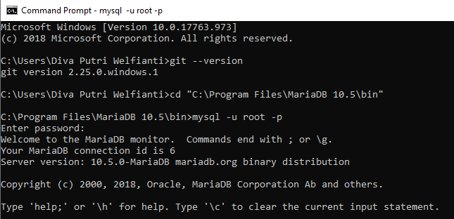
gambar 2
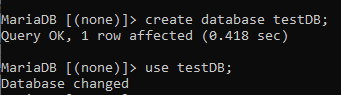
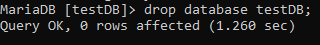
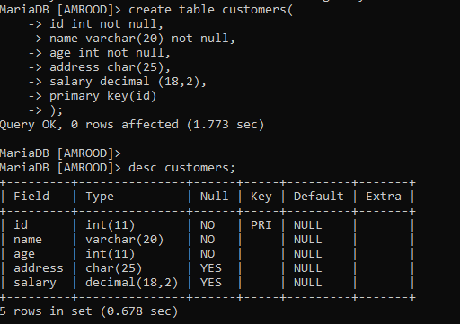
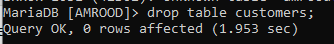
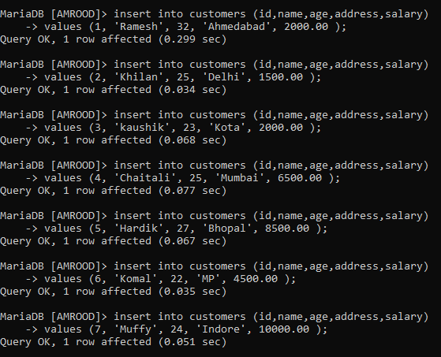
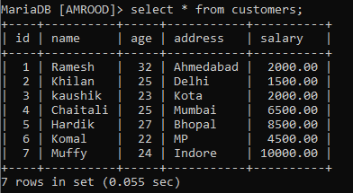
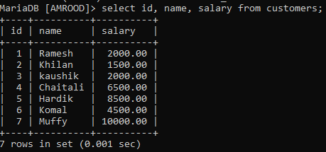
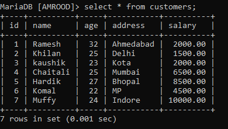
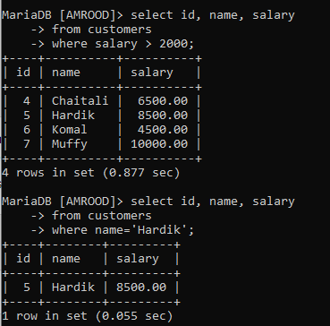
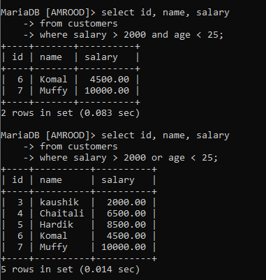
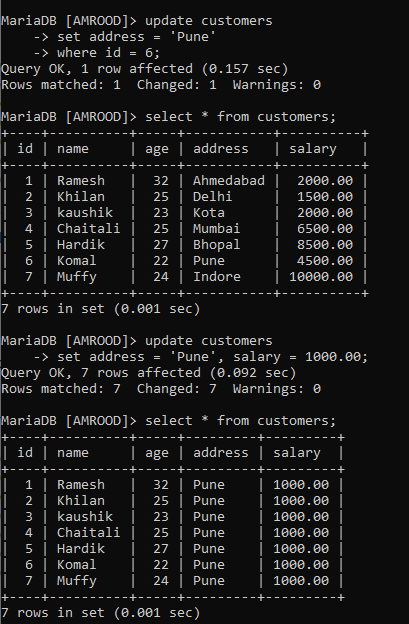
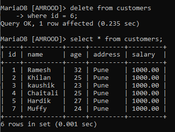
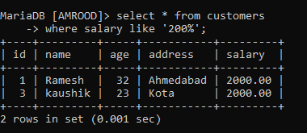
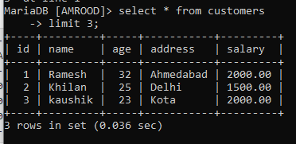
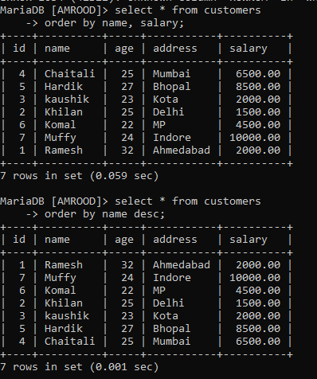
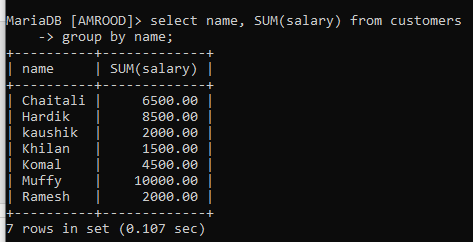
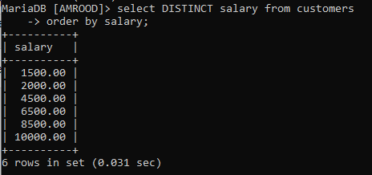
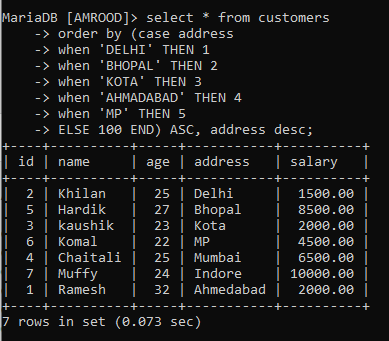
# Tugas 
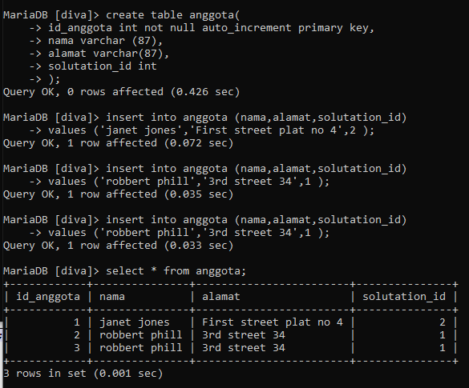
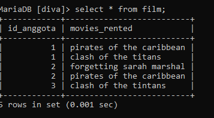
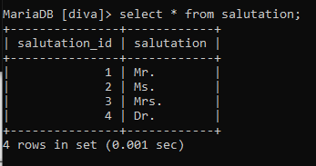