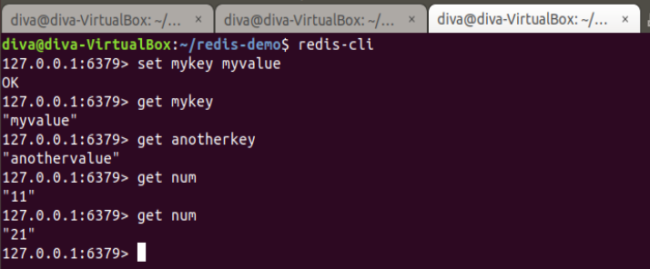

Nama    : Diva Putri Welfianti
NIM     : 185610081

Pad pertemuan 5 ini kita akan mempelajari tentang Redis Lanjut. maka dari itu pada praktik ini saya menggunakan Linux untuk mengerjakan praktiknya. 

langkah pertama adalah kita akan menjalankan redisnya. sebelum itu perlu kita persiapkan semua kebutuhan pada praktik ini, kita harus mempunyai python juga. maka pada gambar pertama dan kedua akan terlihat hasil ketika kita memulai menjalankan redis. 

pada gambar ketiga diatas kita akan menginstall python terlebih dahulu.

dan pada gambar diatas dapat kita lihat kita telah bisa mencek redis dan melanjutkan menginstall python-pip pada redis.

selanjutnya pada gambar ke-9 ini kita akan mrnginstall redis, seperti yang terlihat telah selesai, kita dapat menjalankan praktik ini.

lalu kita akan menyambungkan redis dan python menggunakan panduan yang telah ada dimoduul.

selanjutnya kita akan menjalankan aplikasinya dengan membuka tab baru dan langsung jalankan redisnya terlebih dahulu. 

selanjutnya kita akan membuka satu tab lagi untuk menjalankan python .

selanjutnya kita akan mengikuti perintah yang ada di modul sampai selesai.

