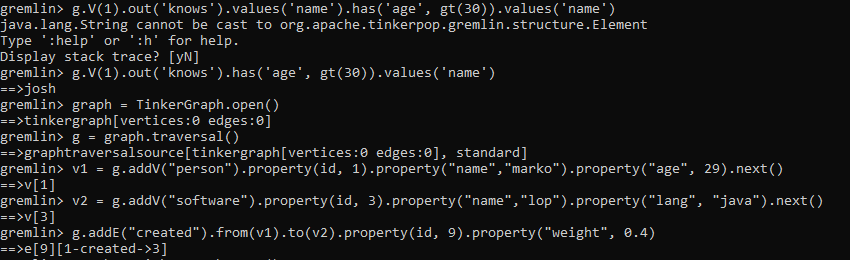
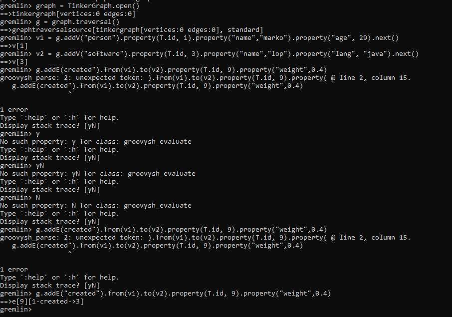

# LAPORAN

LATIHAN
1. sudah selesai download Apache Tinkerpop,  Gremlin Server serta Gremlin Console
2. berikut hasilnya :

    
    
    
     
     
     

TUGAS 
1. JanusGraph adalah sumber terbuka, database grafik terdistribusi di bawah The Linux Foundation.  JanusGraph tersedia di bawah Lisensi Apache  2.0. Proyek ini didukung oleh IBM, Google, dan Hortonworks . JanusGraph mendukung berbagai backend penyimpanan (Apache Cassandra, Apache HBase, Google Cloud Bigtable, Oracle BerkeleyDB, Scylla) Skalabilitas JanusGraph tergantung pada teknologi yang mendasarinya, yang digunakan dengan JanusGraph. Misalnya, dengan menggunakan Apache Cassandra sebagai penskalaan backend penyimpanan ke beberapa pusat data disediakan di luar kotak.
2. 
